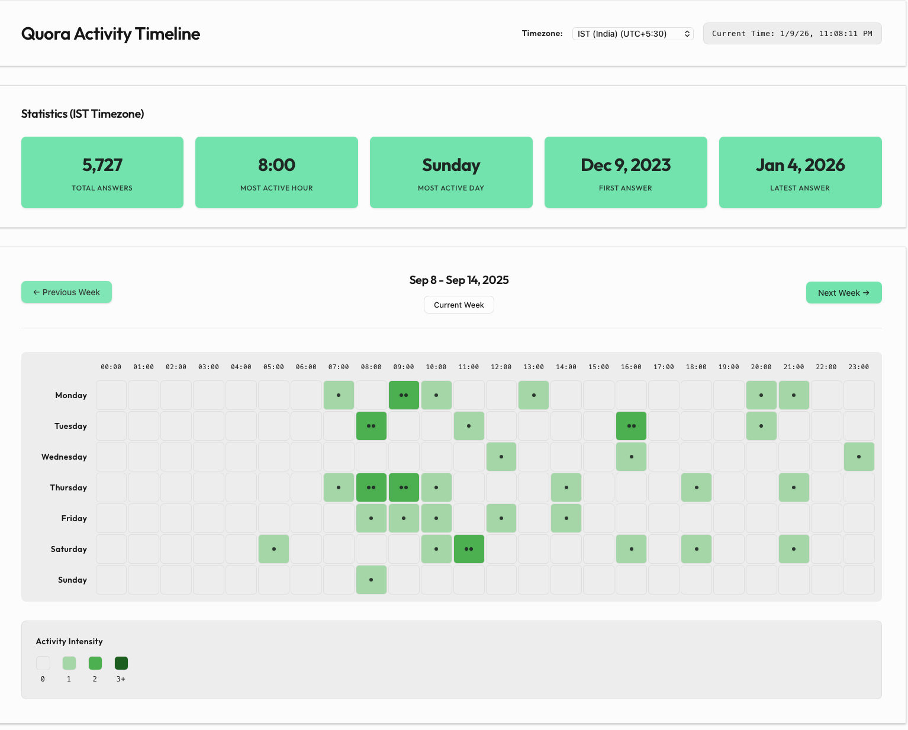

# Quora Answer Scraper for Kanthaswamy Balasubramaniam

A comprehensive Scrapy-based web scraper to extract all 28,000+ answers from Quora user "Kanthaswamy Balasubramaniam" and store them in PostgreSQL.

## Dashboard Preview



> Interactive calendar heatmap showing answer activity patterns with timezone support. See [`visualization/README.md`](visualization/README.md) for details.


## Features

- **Google OAuth Authentication**: Automated login via Google OAuth
- **Anti-Detection Technology**: Chrome DevTools Protocol (CDP) connection for stealth browsing
- **Resume Capability**: Can resume from interruptions without data loss
- **Dual Mode Operation**: Separate collection and processing modes

## Installation

1. **Install uv** (if not already installed):
   [`https://docs.astral.sh/uv/getting-started/installation/`](Install uv) 
   > **Why uv?** uv is 10-100x faster than pip, has better dependency resolution, and provides a more reliable installation experience. All pip commands work with `uv pip`.
2. **Clone and setup the project:**
   ```bash
   cd quora_analysis
   uv pip install -e .
   ```

5. **Configure environment variables:**
   ```bash
   cp env_example.txt .env
   ```
   
   Edit `.env_example` with your database credentials:
   ```
   DATABASE_URL=
   GOOGLE_EMAIL=
   ```

## Usage

### Quick Start

1. **Test your setup:**
   ```bash
   python tests/test_database_integration.py
   ```

2. **Run the interactive interface:**
   ```bash
   python scripts/main.py
   ```

### Manual Setup

1. **Initialize the database:**
   ```bash
   python scripts/setup_database.py
   ```

2. **Install processing dependencies** (if needed):
   ```bash
   uv pip install html-to-markdown pytz
   ```

### Command Line Options

```bash
python scripts/run_scraper.py --help
```

**Available Modes:**
- `--mode collect` (default): Collect answer URLs from profile page
- `--mode process`: Process existing URLs and populate answer data

## Anti-Detection Technology

This scraper uses advanced techniques to avoid detection by Quora's anti-bot systems:

### Browser Setup

Start Chrome with debugging enabled:
```bash
python start_chrome_debug.py
```

Or manually:
```bash
# macOS ARM (M1/M2/M3)
exec arch -arm64 /Applications/Google\ Chrome.app/Contents/MacOS/Google\ Chrome \
  --remote-debugging-port=9222 --user-data-dir=/tmp/chrome_debug_profile

# macOS Intel
/Applications/Google\ Chrome.app/Contents/MacOS/Google\ Chrome \
  --remote-debugging-port=9222 --user-data-dir=/tmp/chrome_debug_profile

# Windows  
"C:\Program Files\Google\Chrome\Application\chrome.exe" \
  --remote-debugging-port=9222 --user-data-dir=C:\temp\chrome_debug_profile
```

### Testing your setup

Test your setup:
```bash
python tests/test_answer_processor.py
```

This will verify:
- CDP connection to existing Chrome
- Authentication status
- Ability to access Quora pages without detection

## Performance Expectations

- **Runtime**: 8-10 hours for complete scraping
- **Target**: 28,000+ answers
- **Rate**: ~0.8-1.2 answers per second (respectful to Quora's servers)
- **Concurrency**: 1-3 concurrent requests

### Graceful Shutdown

- Press `Ctrl+C` to stop scraping
- Data is saved incrementally, so no loss on interruption
- Resume by running the scraper again

### Usage Workflow

1. **First Run**: Use collection mode to gather all answer URLs
   ```bash
   python scripts/run_scraper.py --mode collect
   ```

2. **Second Run**: Use processing mode to populate answer data
   ```bash
   python scripts/run_scraper.py --mode process
   ```

3. **Monitor Progress**: Check database status anytime
   ```bash
   python scripts/main.py  # Option 4: Check status
   ```

## License

This project is for educational and research purposes only. Please respect Quora's terms of service and rate limits.
